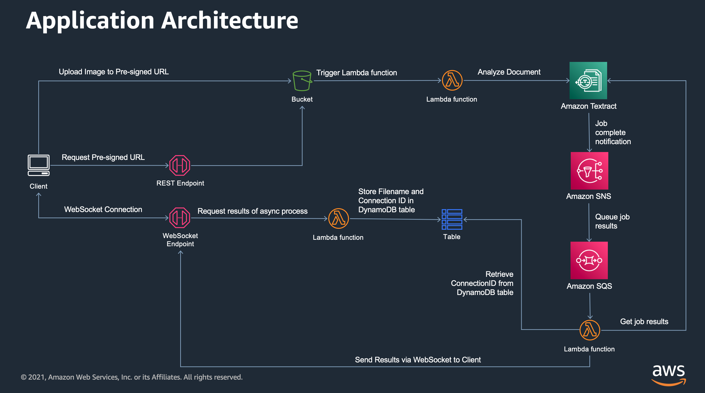

# API Gateway Websocket example: Returning asynchronous results to web clients

Web clients have numerous ways of checking on the progress of an asynchronous operation: polling, long polling and websockets.
This example application shows how to setup Amazon API Gateway websockets to return the results of an asynchronous Amazon Textract operation.




Important: this application uses various AWS services and there are costs associated with these services after the Free Tier usage - please see the [AWS Pricing page](https://aws.amazon.com/pricing/) for details. You are responsible for any AWS costs incurred. No warranty is implied in this example.

```bash
.
├── README.MD              <-- This instructions file
├── backend                <-- Source code for the backend application
├── frontend               <-- Source code for the Vue front-end application
```

## Requirements

* An AWS account. ([Create an AWS account](https://portal.aws.amazon.com/gp/aws/developer/registration/index.html) if you do not already have one and login.)
* AWS CLI already configured with Administrator permission
* [AWS SAM CLI installed](https://docs.aws.amazon.com/serverless-application-model/latest/developerguide/serverless-sam-cli-install.html) - **minimum version 0.48**.
* [NodeJS 14.x installed](https://nodejs.org/en/download/)
* [Vue.js and Vue CLI installed](https://vuejs.org/v2/guide/installation.html)

## Backend installation Instructions 

1. Fork this repo

2. Clone the repo onto your local development machine:
```bash
git clone https://github.com/aws-samples/aws-websocket-async-updates
```

3. Deploy the backend application:
```bash
sam build
sam deploy --guided
```

4. Once deployed, take not of the following outputs from the SAM build command
```bash
UploadAPI: The API endpoint to upload images
WebSocketURL: The WebSocket endpoint
```
## Frontend installation instructions

The frontend code is saved in the `frontend` subdirectory. 

1. Create a .env text file in the `frontend` subdirectory
2. Add the following to the .env file
```bash
VUE_APP_UploadAPI=  <The UploadAPI value from step 4 of the backend installation>
VUE_APP_WebSocketURL= <The WebSocketURL value from step 4 of the backend installation>
```
3. Install the dependencies (once off)
```
npm install
```

4. Start the frontend
```bash
npm run serve
```

## Cleanup

1. Manually delete any objects in the application's S3 buckets.
2. Use the CloudFormation console to delete all the stacks deployed.

## Next steps


If you have any questions, please contact the author or raise an issue in the GitHub repo.

==============================================

Copyright 2021 Amazon.com, Inc. or its affiliates. All Rights Reserved.

SPDX-License-Identifier: MIT-0

